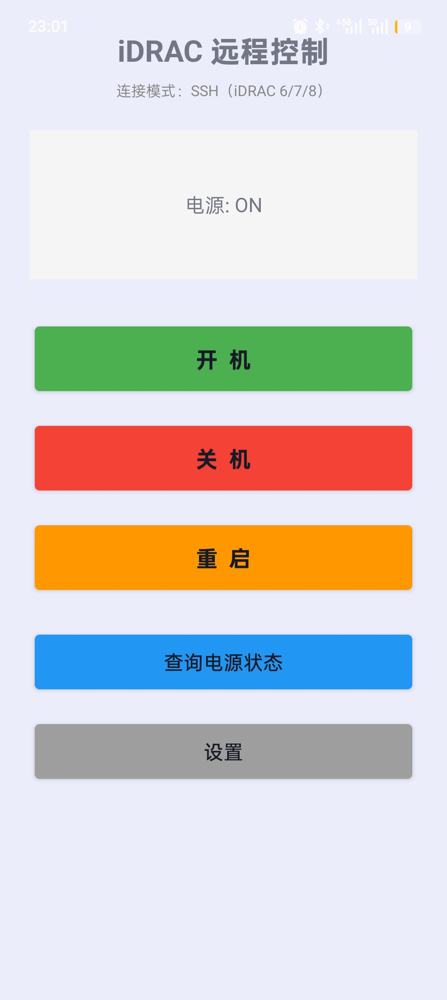

# iDRAC 控制器 - Android App

通过 Android 手机远程控制 Dell 服务器电源（开机 / 关机 / 重启 / 查询状态），支持 Redfish API 和 SSH (racadm) 两种模式。


## 应用截图



*暗色科技风主界面 - 卡片式布局，状态面板与控制面板分区显示*


## 功能

- 远程开机 / 关机 / 重启 Dell 服务器
- 查询电源状态
- 支持 **Redfish API** 和 **SSH (racadm)** 两种连接方式
- 自定义 SSH / HTTPS 端口（适配端口映射场景）
- 保存 iDRAC 连接配置
- **暗色科技风 UI** — 深蓝黑底色 + 青色强调，卡片式布局，色彩编码按钮（绿=开机 / 红=关机 / 橙=重启）

## 支持的 iDRAC 版本

| 版本 | Redfish 模式 | SSH 模式 |
|------|------------|---------|
| iDRAC 7 | — | 支持 |
| iDRAC 8 | 部分支持 | 支持 |
| iDRAC 9 | 完全支持 | 支持 |

## 安装

从 [Releases](https://github.com/tblfokb/idrac-controller/releases) 页面下载最新 APK，在 Android 设备上安装即可。

最低要求：Android 4.4 (API 19)

## 使用说明

### 1. 配置连接
1. 打开 App，点击右上角设置图标
2. 输入 iDRAC IP 地址
3. 输入用户名（默认 `root`）和密码
4. 选择连接模式（Redfish / SSH）
5. （可选）自定义端口号 — 做了端口映射时可在此修改
6. 点击保存

### 2. 控制电源
- **查询状态** — 查看服务器当前电源状态
- **开机** — 发送开机指令
- **关机** — 强制关机
- **重启** — 强制重启

## 端口映射

如果需要从外网访问 iDRAC，在路由器映射以下端口：

| 端口 | 协议 | 用途 |
|------|------|------|
| 443 | TCP | Redfish API / Web 管理 |
| 22 | TCP | SSH (racadm) |

映射后，在 App 设置中将端口号改为映射后的外部端口即可。

## 构建

### 前置条件
- JDK 17+
- Android SDK (platforms;android-35, build-tools;35.0.0)

### 快速构建
```bash
# Windows
python build_apk.py

# 或使用 bat
build_apk.bat
```

构建产物在 `out/apk/app-debug.apk`。

### 依赖库
- OkHttp 4.12.0 (HTTP 客户端)
- Gson 2.10.1 (JSON 解析)
- JSch 0.1.55 (SSH 连接)
- Kotlin Stdlib 2.0.21

## 安全建议

- 不要将 iDRAC 直接暴露在公网
- 使用强密码
- 推荐通过 VPN 访问内网 iDRAC
- 定期更新 iDRAC 固件

## 许可

MIT License

---

## 更新日志

### v1.2 (2026-06-24)
- 暗色科技风 UI 全面美化
- 卡片式分区布局，状态与控制面板分离
- 圆角按钮和输入框，颜色编码区分功能
- 自定义暗色 Spinner 下拉样式
- 修复主题兼容性（API 19+）

### v1.1 (2026-06-24)
- 修复 Android 16 闪退问题（NoClassDefFoundError: Gson）
- 新增自定义 SSH / HTTPS 端口号功能

### v1.0 (2026-06-24)
- 首个版本，支持 Redfish 和 SSH 双模式远程控制
